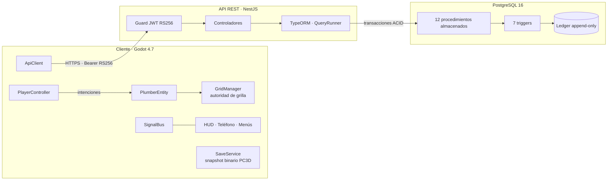

<div align="center">

# 🛠️ PipeCorp3D

**Simulador laboral 3D de gasfitería con arquitectura cliente-servidor, economía persistente y jurisdicción SISS**

*Portafolio de Título PTY4479 · Analista Programador Computacional · Duoc UC*


<br>


[Descripción](#-descripción) ·
[Arquitectura](#️-arquitectura) ·
[Instalación](#-instalación-y-ejecución) ·
[Controles](#-controles) ·
[Pruebas](#-pruebas) ·
[Metodología](#-metodología) ·
[Roadmap](#️-roadmap)

</div>

---

## 📖 Descripción

La formación de un gasfíter ocurre en terreno, donde cada error tiene un costo material, comercial y legal; intervenir la red pública está fiscalizado por la **Superintendencia de Servicios Sanitarios (SISS)**. **PipeCorp3D** permite practicar sin riesgo el ciclo completo de un trabajo: **plazo, instalación, costo y legalidad**.

El jugador dirige su propia PYME de gasfitería en primera persona:

1. Recibe trabajos (**tickets**) con temporizador en un teléfono virtual.
2. Acepta un trabajo y compra los materiales en una sola transacción.
3. Instala tuberías sobre una **grilla determinista de sockets**.
4. Recibe una **nota de S a F** y un pago calculados en el servidor.
5. Respeta la jurisdicción SISS: **derivar** un problema de la red pública otorga reputación; **intervenirla** genera multa y, ante reincidencia, un **Game Over irreversible**.

> **Principio de diseño:** el cliente solo expresa intenciones. Las reglas económicas y legales viven en PostgreSQL, por lo que ninguna capa cliente puede saltárselas.

---

## 🏗️ Arquitectura



| Capa | Tecnología | Decisiones clave |
|---|---|---|
| **Persistencia autoritativa** | PostgreSQL 16 | 10 tablas normalizadas, 7 triggers y 12 procedimientos almacenados. Transacciones ACID en `READ COMMITTED` con bloqueo de fila (`SELECT … FOR UPDATE`). **Ledger append-only**: el saldo siempre cuadra con la suma de movimientos. Máquina de estados de tickets validada por trigger. |
| **API REST** | NestJS · TypeScript · TypeORM | JWT asimétrico **RS256** con lista blanca de algoritmos (bloquea `HS256 con llave pública` y `alg: none`). Contraseñas con **scrypt**. Errores de negocio con códigos SQL propios `PC001–PC007` traducidos a HTTP. |
| **Cliente** | Godot 4.7 · GDScript | Tipado estático estricto configurado como **error**. Separación Input/lógica (`PlayerController` posee a `PlumberEntity`), base de la arquitectura **MP-Ready**. Comunicación **por trabajo terminado, no por tubería**. Guardado local binario con `FileAccess`, versionado y con checksum (sin JSON ni datos económicos). |

### Endpoints principales

| Método | Ruta | Descripción |
|---|---|---|
| `GET` | `/health` | Estado del servicio |
| `POST` | `/auth/register` · `/auth/login` | Registro e inicio de sesión (JWT RS256) |
| `GET` | `/profile` | Perfil autoritativo del jugador |
| `GET` | `/tickets` | Tablero de tickets (presupuesto por trigger, expiración perezosa) |
| `POST` | `/tickets/:id/accept` | Acepta el ticket y compra materiales en la misma transacción |
| `POST` | `/tickets/:id/derive` | Deriva un ticket público a la SISS (+reputación) |
| `POST` | `/tickets/:id/tampering` | Registra intervención de la red pública (multa / Game Over) |
| `POST` | `/jobs/:id/complete` | Envía el resumen del trabajo; nota S–F y pago calculados en BD |
| `POST` | `/inventory/purchase` · `/vehicles/upgrade` | Inventario limitado por la capacidad del vehículo |
| `POST` | `/day/end` | Cierre de día y costo de vida |

---

## 📁 Estructura del repositorio

```text
PipeCorp3D/
├── backend/            # API REST NestJS (src/, test/, .env.example)
├── database/           # Scripts SQL 01–04 y run_tests.sh
├── godot/              # Proyecto Godot (abrir godot/project.godot)
│   ├── autoload/       # SignalBus, GridManager, ApiClient, JobSession, SaveService
│   ├── Scripts/        # Núcleo, jugador, datos y mundo
│   ├── UI/             # HUD, teléfono virtual, menús y pantallas
│   ├── tests/          # Pruebas headless, Doctor y mock_api.py
│   └── World.tscn      # Escena principal
└── docs/               # Diagramas (mapa mental, actores, E-R, visión, impact mapping)
```

---

## 🚀 Instalación y ejecución

### Requisitos

| Herramienta | Versión |
|---|---|
| PostgreSQL | 16 |
| Node.js | 18 LTS o superior |
| Godot | 4.7 (estándar, no .NET) |
| Git Bash | Para ejecutar los scripts `.sh` en Windows |

### 1. Base de datos

Crea una base de datos vacía y ejecuta los scripts **en orden (01 → 04)**:

```bash
createdb -U postgres pipecorp
for f in database/0*.sql; do psql -U postgres -d pipecorp -f "$f"; done
```

> Usa el mismo nombre de base de datos y usuario que configures en `backend/.env`.

### 2. API

```bash
cd backend
cp .env.example .env     # completa las credenciales de la base de datos y las rutas de las llaves RSA
npm install
npm run start:dev
```

Verifica que la API responde en <http://localhost:3000/health>.

> 🔐 El archivo `.env` y las llaves RSA **nunca** se versionan.

### 3. Cliente

1. Abre el **Project Manager** de Godot → **Import** → selecciona `godot/project.godot`.
2. Con la API en ejecución, presiona **F5** (la escena principal es `World.tscn`).
3. Haz clic en **Iniciar Turno**.

---

## 🎮 Controles

| Tecla | Acción |
|---|---|
| `W` `A` `S` `D` + mouse | Moverse y mirar |
| `Clic` | Instalar una tubería en el socket apuntado |
| `T` | Abrir el teléfono (tablero de tickets) |
| `F` | Terminar el trabajo en curso |
| `C` | Cambiar de gasfíter (Player_1 ↔ Player_2) |
| `N` | Nueva Carrera tras un Game Over |
| `P` | Pausar / reanudar |
| `Esc` | Liberar el mouse |

---

## 🧪 Pruebas

**127 pruebas automatizadas aprobadas · 0 errores de typecheck.** Ninguna tarjeta pasa a *Done* sin su suite en verde y evidencia adjunta.

| Suite | Herramienta | Resultado |
|---|---|---|
| Base de datos: reglas SISS, economía y concurrencia | `run_tests.sh` | 15/15 |
| API: tipos estrictos | `tsc --noEmit` (strict) | 0 errores |
| API: unitarias | Jest | 8/8 |
| API: autenticación y seguridad | Jest + Supertest (e2e) | 12/12 |
| API: bucle de juego | Jest + Supertest (e2e) | 15/15 |
| Godot: núcleo (grilla, entidad, arquitectura) | Escena headless | 28/28 |
| Godot: integración cliente-servidor y guardado | Escena headless + API simulada | 24/24 |
| Godot: prueba de humo de UI | Escena headless + API simulada | 22/22 |
| Godot: zona SISS | Escena headless | 3/3 |

### Cómo ejecutarlas

**Base de datos** (Git Bash):

```bash
cd database
bash run_tests.sh
```

**API:**

```bash
cd backend
npm run dod      # typecheck + unitarias + e2e
```

**Godot** — las pruebas de integración y de UI usan una API simulada para no tocar datos reales:

```bash
# Terminal 1: API simulada (reiníciala antes de cada suite)
cd godot/tests
python mock_api.py

# Terminal 2: abre la escena de prueba en Godot y presiona F6
#   res://tests/TestIntegration.tscn   → INTEGRATION DoD: 24 passed
#   res://tests/TestUISmoke.tscn       → UI SMOKE: 22 passed
```

> 🩺 `res://tests/Doctor.tscn` (F6) diagnostica scripts que no compilan, clases duplicadas, autoloads y el cableado de `World.tscn`. No requiere la API.

---

## 📊 Metodología

Desarrollado con **Scrum** en tres sprints a partir de un Product Backlog derivado de la planificación de la Fase 1.

| Sprint | Fechas | Comprometido | Terminado |
|---|---|---|---|
| Sprint 1 | 21–27 sep 2026 | 22 pts | 22 pts |
| Sprint 2 | 28 sep–4 oct 2026 | 23 pts | 15 pts |
| Sprint 3 | 5 oct 2026 | 21 + 5 pts | 26 pts |
| **Total** | | | **63 pts · 18 historias** |

- **GitFlow:** cada tarjeta de Trello en una rama `feature/*`, integrada a `develop` con `--no-ff`; releases etiquetadas en `main` (`v1.0.0-mvp`, `v1.0.1`, `v1.0.2`).
- **Definition of Done:** código auditado, tipado estricto sin advertencias, suites al 100%, secretos fuera del repositorio y evidencia adjunta en Trello.
- **Trazabilidad:** 17 ajustes justificados respecto de la Fase 1, documentados en el portafolio.

### Historial de versiones

| Versión | Contenido |
|---|---|
| `v1.0.2` | README profesional del repositorio |
| `v1.0.1` | Menú de pausa (`P`), correcciones del Doctor y de la API simulada, proyecto Godot movido a la raíz de `godot/` |
| `v1.0.0-mvp` | MVP jugable de punta a punta: 18 historias, 63 puntos |

---

## 🗺️ Roadmap

Diferido a **v1.1**, con su justificación documentada:

- [ ] Hotbar de 2 espacios con herramientas de rango F–S
- [ ] Sellado con llave y partículas de fuga
- [ ] Interfaz de tienda y mejora de vehículos (la lógica ya existe en el servidor)
- [ ] Contratos desbloqueados por XP
- [ ] Cuentas independientes por gasfíter (multijugador real)
- [ ] Contenedor Docker para levantar base de datos y API con un comando

---

## 👤 Autor

**Yolzer Awidan Saravia San Martín**
Analista Programador Computacional · Duoc UC
Docente guía: Alberto Campos Vidal

<sub>Proyecto académico desarrollado para el Portafolio de Título (PTY4479), octubre de 2026.</sub>
